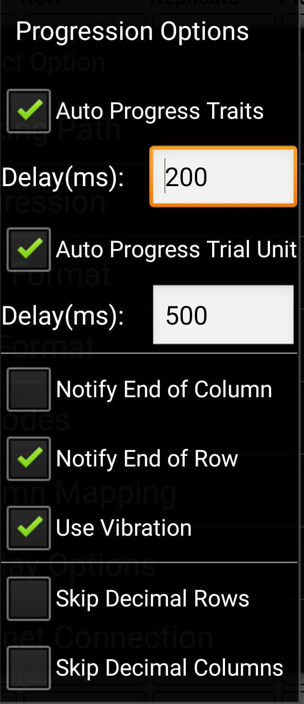
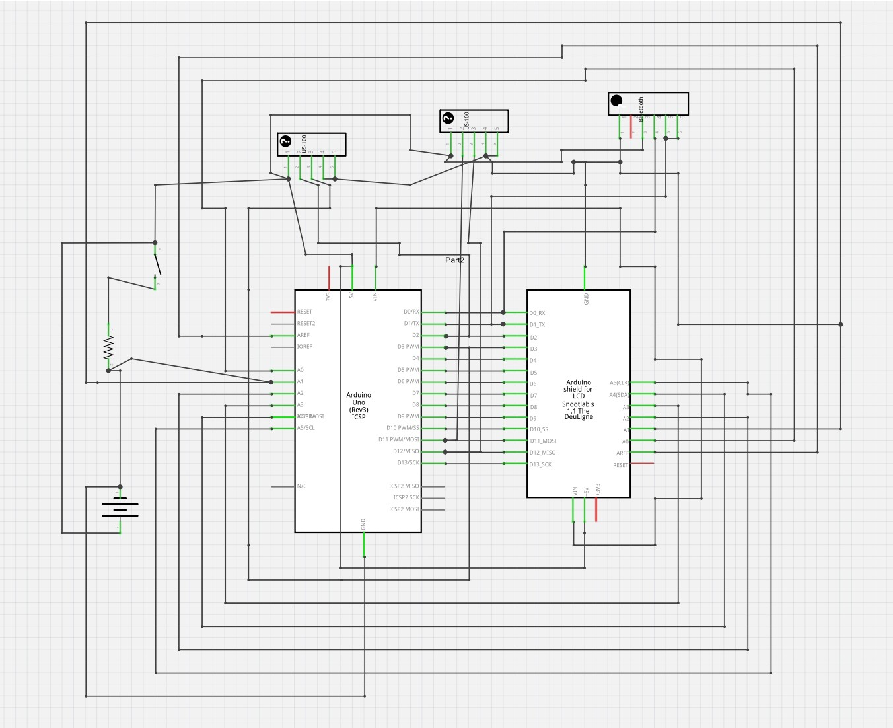

# PhenoXonar
## Description
The PhenoXonar is a low-cost and open source device developed to provide the user with reliable height measurements. Two 40kHz ultrasonic sonar modules, with temperature compensation system,  delivers data every 10ms alternating between each one in order to sample different points throughout the measurement.

## Connecting to Fieldscorer4Android

The following settings are needed at Menu/Options/Progression/

 * **To insert fields** thick Auto Progress Trait with a Delay(ms) of 200.
 * **To automatically change plot** thick Auto Progress Trial Unit with a Delay(ms) of 500. 	

## Components
 * US-100 Ultrasonic sonar module.
 * SainSmart UNO microcontroller based on the ATmega328. 
 * SainSmart LCD keypad shield.
 * Bluetotth module rs232.

 

## License

This program is free software: you can redistribute it and/or modify it under the terms of the GNU General Public License as published by the Free Software Foundation, either version 3 of the License, or (at your option) any later version. This program is distributed in the hope that it will be useful, but WITHOUT ANY WARRANTY; without even the implied warranty of
MERCHANTABILITY or FITNESS FOR A PARTICULAR PURPOSE.  See the GNU General Public License for more details.
